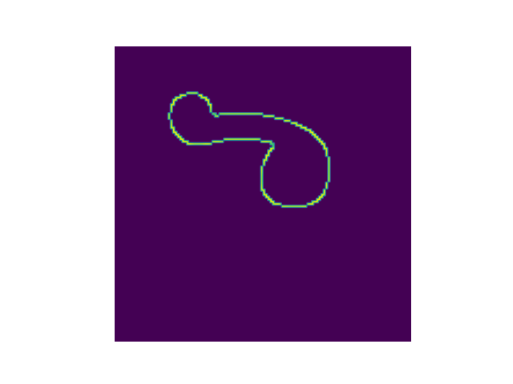
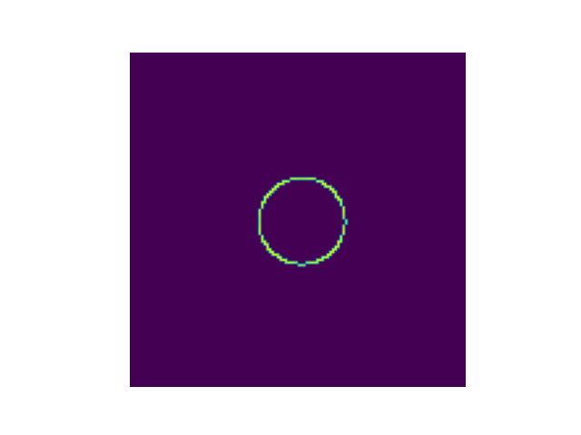

<h1 align="center" style="margin-top: 0px;">Canny Edges</h1>
<h3 align="center" style="margin-top: 0px;">Find Edges via Canny Edge-Finding Algorithm: for Pytorch</h3>

    
    
    

    
    

    
    

&emsp;

A simple class to return a mask representing edges found by the Canny Edge-Finding algorithm. Supports images formatted in common ML batches [B, C, h, w], with float32 data, and values spanning [0,1]. Can optionally apply a gaussian blur to image inputs before finding edges.

Supports any number of channels C. Supports cpu and gpu data. Written entirely in native Pytorch-python.

One or two operations included from Pytorch precludes jit compilation using torchscript. Easily adaptable to allow same. 